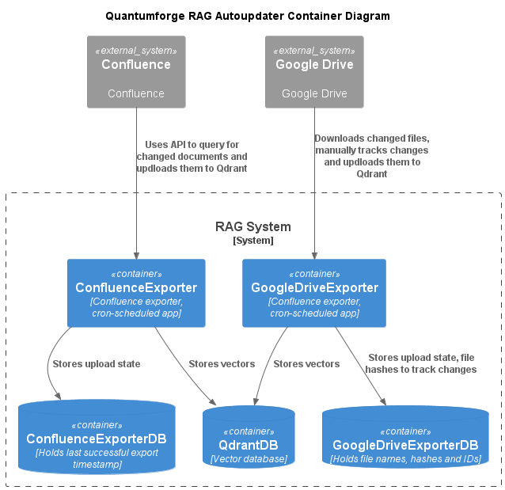
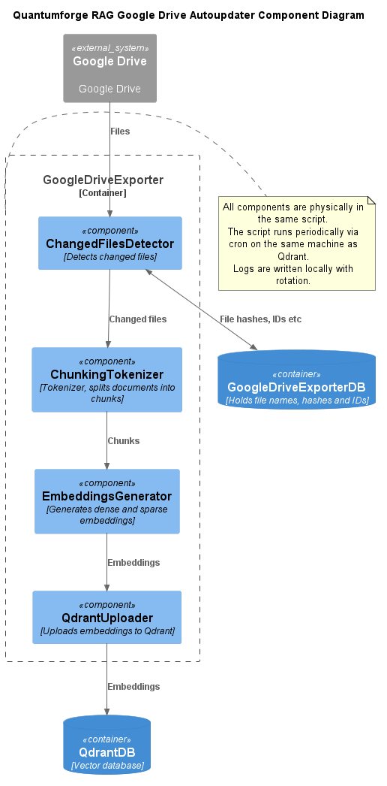

### Модельный скрипт - описание

Модельный скрипт смотрит в каталог, детектирует изменения, считая хеши и сохраняя их в отдельном файле, и записывает векторы в Qdrant.  

Обновляться будет только БД локальной модели.  

Здесь и далее предполагается, что установлен pyenv и в нём установлен python 3.11.16 (см. README всего проекта).  

Также предполагается, что запущен Qdrant (см. Задание 3).  

База знаний полностью копируется в отдельный каталог, загрузка происходит в отдельную коллекцию wiki-cron-local - чтобы не влиять на последующие задания.  

Используется локальная модель.  

Все настройки (cron, права на файлы) делаются для текущего пользователя.  

Коллекция Qdrant обновляется раз в минуту.  

Логи обновления, соответствующие действиям в разделе ниже можно посмотреть в ```upload.log```.  

### Модельный скрипт - запуск

Чистим локальную коллекцию (если требуется):  

```
curl -X DELETE http://localhost:6333/collections/wiki-cron-local | jq .
```

Устанавливаем скрипты:  

```
sudo make install
```

Эта команда:  

* Создаёт каталоги и копирует скрипты
* Копирует базу знаний без одного файла Сёку.txt, ID 9
* Настраивает cron раз в минуту

Смотрим log (через несколько минут, примерно 4 минуты на моём ноутбуке):  

```
cat /var/log/practicum7/upload.log

2026-10-01 23:57:13 | INFO     | started processing 85 new, changed or deleted wiki pages
2026-10-02 00:00:06 | INFO     | successfully uploaded 115 chunks from 85 new or changed wiki pages, 0 pages deleted, total collection size is 115
```

Смотрим размер коллекции:

```
curl -s -X POST http://localhost:6333/collections/wiki-cron-local/points/count   -H 'Content-Type: application/json'   -d '{
    "exact": true
  }' | jq .result.count
115
```

Смотрим содержимое документов с ID 9 и 86:

```
curl -s -X POST 'http://localhost:6333/collections/wiki-cron-local/points/scroll' -H 'Content-Type: application/json' -d '{
    "filter": {
      "must": [
        {
          "key": "page_id",
          "match": {
            "any": [9, 86]
          }
        }
      ]
    },
    "with_payload": true,
    "with_vector": false
  }' | jq .
```

\- документ 9 отсутствует, в документе 86 слово "способен":

```
{
  "result": {
    "points": [
      {
        "id": 86001,
        "payload": {
          "page_id": 86,
          "title": "Мышь",
          "chunk_id": 1,
          "page_content": "Title: Мышь\nБоевой колдун-калейдоскоп, способен превращаться в мышей различных пород. Друг и постоянный напарник Хомячка. По слухам был Ночным Другим."
        }
      }
    ],
    "next_page_offset": null
  },
  "status": "ok",
  "time": 0.01309133
}
```

Смотрим ещё через некоторое время:

```
cat /var/log/practicum7/upload.log

...

2026-10-02 00:01:14 | INFO     | nothing to upload or delete
```

\- загружать нечего.

Копируем недостающий файл и меняем другой:

```
cp ../Task2/knowledge_base/Сёку.txt /var/lib/practicum7/knowledge_base/ && sed -i s/способен/способный/g /var/lib/practicum7/knowledge_base/Мышь.txt
```

Ждём и смотрим в лог:

```
cat /var/log/practicum7/upload.log

...

2026-10-02 00:02:13 | INFO     | started processing 2 new, changed or deleted wiki pages
2026-10-02 00:02:14 | INFO     | successfully uploaded 2 chunks from 2 new or changed wiki pages, 0 pages deleted, total collection size is 116

```

Смотрим размер коллекции:

```
curl -s -X POST http://localhost:6333/collections/wiki-cron-local/points/count   -H 'Content-Type: application/json'   -d '{
    "exact": true
  }' | jq .result.count
116
```

\- добавился 1 документ.

Смотрим содержимое документов с ID 9 и 86:

```
curl -s -X POST 'http://localhost:6333/collections/wiki-cron-local/points/scroll' -H 'Content-Type: application/json' -d '{
    "filter": {
      "must": [
        {
          "key": "page_id",
          "match": {
            "any": [9, 86]
          }
        }
      ]
    },
    "with_payload": true,
    "with_vector": false
  }' | jq .
```

\- документ 9 появился, в документе 86 слово "способный":

```
{
  "result": {
    "points": [
      {
        "id": 9001,
        "payload": {
          "page_id": 9,
          "title": "Сёку",
          "chunk_id": 1,
          "page_content": "Title: Сёку\nон же \"Прокурор Ушедших\", он же \"Чернота Ночи\" Великий Ночной колдун, давно отошедший от дел и живущий жизнью обычного Другого в Мехико. Упоминается в книге \"Взгляд Тёмной Атлантиды\"."
        }
      },
      {
        "id": 86001,
        "payload": {
          "page_id": 86,
          "title": "Мышь",
          "chunk_id": 1,
          "page_content": "Title: Мышь\nБоевой колдун-калейдоскоп, способный превращаться в мышей различных пород. Друг и постоянный напарник Хомячка. По слухам был Ночным Другим."
        }
      }
    ],
    "next_page_offset": null
  },
  "status": "ok",
  "time": 0.002857589
}
```

Удаляем файл с ID 86:

```
rm /var/lib/practicum7/knowledge_base/Мышь.txt
```

Ждём и смотрим в лог:

```
cat /var/log/practicum7/upload.log

...

2026-10-02 00:04:14 | INFO     | started processing 1 new, changed or deleted wiki pages
2026-10-02 00:04:14 | INFO     | successfully uploaded 0 chunks from 0 new or changed wiki pages, 1 pages deleted, total collection size is 115
```

Смотрим размер коллекции:

```
curl -s -X POST http://localhost:6333/collections/wiki-cron-local/points/count   -H 'Content-Type: application/json'   -d '{
    "exact": true
  }' | jq .result.count
115
```

\- удалился 1 документ.

Смотрим содержимое документов с ID 9 и 86:

```
curl -s -X POST 'http://localhost:6333/collections/wiki-cron-local/points/scroll' -H 'Content-Type: application/json' -d '{
    "filter": {
      "must": [
        {
          "key": "page_id",
          "match": {
            "any": [9, 86]
          }
        }
      ]
    },
    "with_payload": true,
    "with_vector": false
  }' | jq .
```

\- документ 86 удалён:

```
{
  "result": {
    "points": [
      {
        "id": 9001,
        "payload": {
          "page_id": 9,
          "title": "Сёку",
          "chunk_id": 1,
          "page_content": "Title: Сёку\nон же \"Прокурор Ушедших\", он же \"Чернота Ночи\" Великий Ночной колдун, давно отошедший от дел и живущий жизнью обычного Другого в Мехико. Упоминается в книге \"Взгляд Тёмной Атлантиды\"."
        }
      }
    ],
    "next_page_offset": null
  },
  "status": "ok",
  "time": 0.002096551
}
```

Для окончательной проверки сделаем запрос к Qdrant:

```
python /opt/practicum7/bin/index_or_query.py --collection wiki-cron-local --query "Какие бывают колдуны?" | head -15

Query: Какие бывают колдуны?

================================================================================
#1  RRF=0.032522
Title: Колдовская температура
Page ID: 3
Chunk: 1

Title: Колдовская температура
В Сером Патруле раскрывается природа силы Других. Колдовскую энергию производят люди и вообще все живые существа. Колдуны в большинстве случаев производят меньше энергии, чем люди: их "колдовская температура" ниже. Благодаря этому колдуны могут использовать энергию, производимую людьми. Таким образом, все Другие являются паразитами, хотя большинство из них об этом не знает. Чем ниже колдовская температура, тем сильнее Другой и тем выше его уровень.
Самыми могущественными являются колдуны с нулевой температурой — Абсолютные, или нулевые колдуны. За всю историю вражды Дня и Ночи известны несколько подобных иных: Галина Молодецкая (дневной колдун), Марлон (дневной, затем ночной колдун), Юра Матушкин (упырь, искусственно увеличивший свою энергию до предела с помощью книги Сювятар).

================================================================================
#2  RRF=0.032266
``` 

По завершении тестирования убираем за собой:

```
sudo make uninstall
```

## Production решение

Диаграмма контейнеров разработана с учётом двух источников - Confluence и Google Drive.  

На диаграмме компонентов показан только экспорт из Google Drive.  

Идея такая же, как в модельном скрипте - считаем хеши, изменённые файлы пишем в Qdrant.  

Всё запускается на том же хосте из Задания 1.  

Расписание - раз в сутки, в нерабочее время - это можно себе позволить т.к. компания расположена в Европе и не будет слишком широкого диапазона часовых поясов.  

Логи пишутся локально, в задании ничего нет про ELK и тп, потом можно их перенаправить через filebeat.  

### Диаграмма контейнеров



### Диаграмма компонент


